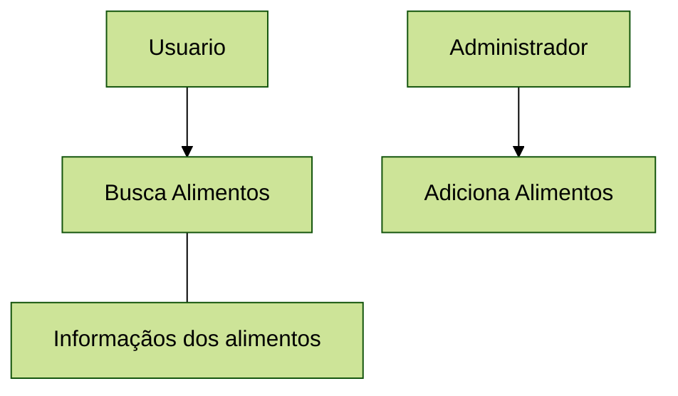

```mermaid
---
config:
  theme: forest
  look: classic
---
flowchart TB
    A["Usuario"] --> B["Busca Alimentos"]
    B --- C["Informaçãos dos alimentos"]
    D["Administrador"] --> E["Adiciona Alimentos"]
```

